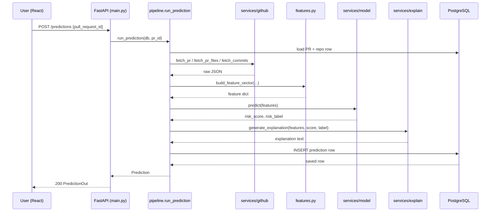

# Low-Level Design (LLD) — v2
## Predictive Deployment Risk Assessment System

**Students:** Shravani Totre (251810700152), Harsh Saini (251810700045) · 2nd Year
**Scope:** 8–10 weeks, 2 developers
**Assumes:** HLD established — React frontend → FastAPI backend → PostgreSQL, with GitHub REST API and OpenAI API as external dependencies, and an in-process XGBoost model.

This revision keeps the architecture of LLD v1 — thin routes, logic in services, one shared feature function — but collapses single-purpose files where the split added structure without adding value, and defers work that is not in the PRD's Must-Have list. The API contract and database schema are unchanged from v1.

---

## 1. Repository / Folder Structure

```
risk-predictor/
├── backend/
│   ├── main.py              # FastAPI app + all route handlers (thin)
│   ├── config.py            # Settings from env vars (pydantic-settings)
│   ├── database.py          # SQLAlchemy engine, SessionLocal, get_db()
│   ├── models.py            # All 4 ORM models
│   ├── schemas.py           # All Pydantic request/response schemas
│   ├── features.py          # ⭐ SHARED feature engineering — training AND serving
│   ├── services/
│   │   ├── github.py        # GitHub REST client
│   │   ├── model.py         # XGBoost load-once + predict()
│   │   ├── explain.py       # Prompt template + OpenAI call
│   │   └── pipeline.py      # Orchestrator: fetch → engineer → predict → explain → save
│   ├── ml/
│   │   ├── collect.py       # Harvest PRs from public repos into a raw dataset
│   │   ├── label.py         # Derive risk labels from revert/hotfix signals
│   │   ├── train.py         # Offline training — imports ../features.py
│   │   ├── model.json       # Trained XGBoost artifact (committed)
│   │   └── metrics.json     # Held-out evaluation results (committed)
│   ├── tests/
│   │   ├── test_features.py # Pure functions, no I/O
│   │   ├── test_model.py    # Sane scores on hand-crafted vectors
│   │   └── test_api.py      # TestClient, GitHub + OpenAI mocked
│   ├── requirements.txt
│   └── .env.example
└── frontend/
    ├── src/
    │   ├── main.jsx
    │   ├── App.jsx
    │   ├── api.js           # Single fetch wrapper — no component calls fetch() directly
    │   ├── pages/
    │   │   ├── Dashboard.jsx    # Connect repo, repo list, PR list, recent predictions
    │   │   └── PRDetail.jsx     # One PR: analyze button, risk, explanation, history
    │   └── components/
    │       ├── RiskBadge.jsx
    │       ├── ExplanationPanel.jsx
    │       └── HistoryTable.jsx
    ├── package.json
    └── tailwind.config.js
```

**Why this shape.** Route handlers stay thin — parse the request, call one service function, return the response. All logic lives in `services/`, so any service function can be unit-tested directly without starting FastAPI. That is the one structural rule worth defending in a review.

**Why `features.py` sits at the backend root** rather than inside `services/`: both `services/pipeline.py` (serving) and `ml/train.py` (training) import it. Placing it one level above both makes "there is exactly one copy of this logic" visible from the folder listing itself. See §5.

---

## 2. Database Layer (SQLAlchemy models)

| Table | Column | Type | Constraints |
|---|---|---|---|
| **users** | id | UUID | PK, default `gen_random_uuid()` |
| | email | VARCHAR(255) | UNIQUE, NOT NULL |
| | created_at | TIMESTAMPTZ | default `now()` |
| **repositories** | id | UUID | PK |
| | user_id | UUID | FK → users.id, indexed |
| | github_repo_id | BIGINT | NOT NULL |
| | owner | VARCHAR(255) | NOT NULL |
| | name | VARCHAR(255) | NOT NULL |
| | connected_at | TIMESTAMPTZ | default `now()` |
| | | | UNIQUE(user_id, github_repo_id) |
| **pull_requests** | id | UUID | PK |
| | repository_id | UUID | FK → repositories.id, indexed |
| | github_pr_number | INT | NOT NULL |
| | title | VARCHAR(500) | |
| | author | VARCHAR(255) | |
| | state | VARCHAR(20) | open / merged / closed |
| | opened_at | TIMESTAMPTZ | |
| | merged_at | TIMESTAMPTZ | nullable |
| | | | UNIQUE(repository_id, github_pr_number) |
| **predictions** | id | UUID | PK |
| | pull_request_id | UUID | FK → pull_requests.id, indexed |
| | risk_score | FLOAT | CHECK (0 <= risk_score <= 1) |
| | risk_label | VARCHAR(10) | Low / Medium / High |
| | features | JSONB | engineered feature snapshot |
| | explanation | TEXT | LLM-generated |
| | model_version | VARCHAR(50) | e.g. "xgb-v1" |
| | created_at | TIMESTAMPTZ | default `now()`, indexed (history sort) |

**`features` is JSONB, deliberately.** The feature set will change every week between W3 and W5. Fixed columns would mean a schema change per experiment; JSONB means the same table absorbs every iteration, and each prediction row carries a permanent snapshot of exactly what the model saw.

**Schema management.** Use `Base.metadata.create_all()` through W7. There is no production data to protect, and the schema churns most during the ML experimentation weeks — versioned migrations there cost time and buy nothing. Introduce Alembic in W8 if the deployed database needs to survive a change.

**Auth is deferred — single-user mode.** The PRD's Must-Have list does not include authentication. The `users` table is kept (the PRD names it) and seeded with one row at startup; `user_id` is resolved from config rather than a token. Every route is written as if the user were authenticated, so adding real auth later is a change to one dependency function, not to every handler.

> To upgrade later: add `hashed_password` to `users`, add `POST /auth/register` and `POST /auth/login`, and replace the `current_user()` dependency's hardcoded lookup with JWT decoding. No route signature changes.

---

## 3. API Contract

| Method | Path | Request Body | Response | Purpose |
|---|---|---|---|---|
| GET | `/health` | — | `{status: "ok"}` | Liveness check |
| POST | `/repositories` | `{owner, name}` | `RepositoryOut` | Connect a public GitHub repo |
| GET | `/repositories` | — | `list[RepositoryOut]` | List connected repos |
| GET | `/repositories/{repo_id}/pull-requests` | — | `list[PullRequestOut]` | List PRs (fetched from GitHub, upserted locally) |
| POST | `/predictions` | `{pull_request_id}` | `PredictionOut` | Run full pipeline |
| GET | `/predictions/pull-request/{pr_id}` | — | `list[PredictionOut]` | History for one PR |
| GET | `/repositories/{repo_id}/predictions` | — | `list[PredictionOut]` | History across a repo |

`PredictionOut`:

```json
{
  "id": "uuid",
  "pull_request_id": "uuid",
  "risk_score": 0.78,
  "risk_label": "High",
  "explanation": "This PR touches 14 files across 6 directories with no test changes...",
  "features": { "files_changed": 14, "has_tests": 0, "...": "..." },
  "model_version": "xgb-v1",
  "created_at": "2026-09-06T12:00:00Z"
}
```

Error responses are uniform: `{"detail": "<human-readable message>"}` with 400 (bad input), 404 (unknown id), 502 (GitHub or OpenAI failed), 500 (anything else). Raw stack traces never reach the frontend.

---

## 4. Module Responsibilities

**`services/github.py`** — Wraps the GitHub REST API using `requests`. Exposes `fetch_pr(owner, repo, number)`, `fetch_pr_files(...)`, `fetch_commits(...)`, `list_pull_requests(owner, repo)`. Raises `GitHubAPIError` on non-2xx. One retry on 5xx or a connection error; on 403 with `X-RateLimit-Remaining: 0`, fail immediately with a clear message rather than retrying.

**`features.py`** — Pure, dependency-free: `build_feature_vector(pr, files, commits) -> dict[str, float]`. No network, no database, no clock reads except through an injected `now` parameter, so it is fully deterministic and testable. **This exact function is imported by both `services/pipeline.py` and `ml/train.py`.** If training and serving computed features even slightly differently, the model would behave differently in production than it did in evaluation — training-serving skew, one of the most common real-world ML bugs. Sharing one function is how you make that failure impossible rather than merely unlikely.

**`services/model.py`** — Loads `ml/model.json` once at module import, not per request. Exposes `predict(features: dict) -> tuple[float, str]`. Orders feature keys using a `FEATURE_ORDER` list saved alongside the model, because XGBoost is positional and a reordered dict silently produces garbage. Maps score to label: `< 0.34` Low, `< 0.67` Medium, else High.

**`services/explain.py`** — Builds a structured prompt from `{features, score, label}` and calls the OpenAI API. The prompt template lives in one module-level constant so it can be iterated on without touching call sites. Instructed to reference only the numeric values supplied, to state the top 2–3 drivers, and to avoid asserting certainty the score does not support. On API failure, returns a deterministic template-based fallback string so a failed LLM call never fails the whole prediction.

**`services/pipeline.py`** — `run_prediction(db, pull_request_id) -> Prediction`. The only place that calls the four modules above in sequence and writes the result. Routes call this, never the individual services. One clear entry point for the whole system.

---

## 5. Shared Feature Contract

`features.py` produces a flat `dict[str, float]`. Booleans are emitted as `0.0` / `1.0` so the vector is uniformly numeric.

| Feature | Type | Derivation |
|---|---|---|
| `files_changed` | int | count of files in the PR |
| `lines_added` | int | sum of additions |
| `lines_removed` | int | sum of deletions |
| `total_churn` | int | added + removed |
| `unique_dirs_touched` | int | distinct top-two-level directories |
| `commit_count` | int | commits in the PR |
| `avg_commit_msg_len` | float | mean commit message length in chars |
| `has_tests` | 0/1 | any changed path matching `test_`, `_test`, `/tests/`, `.spec.`, `.test.` |
| `test_file_ratio` | float | test files ÷ files_changed |
| `touches_config` | 0/1 | any path matching `.yml`, `.yaml`, `.env`, `Dockerfile`, `/migrations/`, `requirements.txt`, `package.json` |
| `touches_ci` | 0/1 | any path under `.github/workflows/` |
| `review_comment_count` | int | from the PR payload |
| `pr_age_hours` | float | opened_at → merged_at, or → `now` if open |
| `is_weekend` | 0/1 | merge day (or current day) is Sat/Sun, UTC |
| `is_off_hours` | 0/1 | merge hour outside 09:00–18:00 UTC |
| `author_pr_count` | int | author's prior merged PRs in this repo (experience proxy) |

Adding a feature is a three-line change: add the computation here, append the key to `FEATURE_ORDER`, retrain. Nothing else in the system needs to know.

---

## 6. Sequence — "Analyze PR" (core flow)



---

## 7. Offline ML Pipeline

Run manually, not part of the served application.

**`ml/collect.py`** — Walks a list of mid-sized public repositories and harvests merged PRs with their files and commits into a raw JSONL dataset. Caches to disk so re-runs do not re-hit the GitHub API. Target: 3,000–5,000 merged PRs across 10–20 repos.

**`ml/label.py`** — Derives the binary `is_risky` label from public signals:

1. **Reverted** — a later commit on the default branch whose message matches `Revert "<PR title>"` or references the PR's merge commit SHA.
2. **Same-area hotfix** — a commit within 7 days of the merge whose message matches `fix|hotfix|patch|bug` **and** which touches at least one file the PR touched.
3. **Linked bug issue** — an issue labelled `bug`, opened after the merge, that references the PR.

> **Caution on signal 3.** "PR linked to a bug issue" is ambiguous and easy to get backwards: a PR that *closes* a bug issue is a fix, not a risk, and labelling those as risky would teach the model the exact opposite of the target concept. Only count issues **created after** the merge that **reference** the PR — never issues the PR closes. If this cannot be determined reliably, drop signal 3 and rely on 1 and 2, which are unambiguous.

Expect roughly 5–15% positives. Handle the imbalance with `scale_pos_weight` and a stratified split, and report **PR-AUC alongside ROC-AUC** — with a class this rare, ROC-AUC alone flatters a weak model.

**`ml/train.py`** — Loads the labelled dataset, calls `features.build_feature_vector` on each row (the same function the API uses), splits **by repository** rather than randomly so the model is evaluated on repos it has never seen, trains XGBoost, and writes `model.json`, `FEATURE_ORDER`, and `metrics.json`.

**Evaluation** — Accuracy, precision, recall, ROC-AUC, PR-AUC, and a confusion matrix on the held-out set. Target ROC-AUC ≥ 0.75. `metrics.json` is committed so the numbers in the report are reproducible.

**Label noise is expected and should be stated, not hidden.** These labels approximate risk from proxy signals; some risky deploys were never reverted, and some reverts were unrelated to risk. Naming this limitation in the evaluation write-up is stronger than presenting the metrics as ground truth.

---

## 8. Frontend Design

**`api.js`** — one wrapper around `fetch`: base URL from `VITE_API_URL`, JSON parsing, and error normalization into a thrown `Error` carrying `detail`. No component calls `fetch()` directly, so an API change is a one-file change.

**Server state** — a small `useApi(path)` hook returning `{data, loading, error}`, plus an explicit `analyze()` mutation on the detail page. React Query is a reasonable upgrade if the manual loading/error handling starts repeating, but for seven endpoints it is not yet worth the extra dependency.

**Pages**
- `Dashboard.jsx` — connect-repo form, list of connected repos, PR list for the selected repo, recent predictions.
- `PRDetail.jsx` — one PR's metadata, an **Analyze** button hitting `POST /predictions`, then `RiskBadge` + `ExplanationPanel` + `HistoryTable` for that PR.

**Components** are purely presentational — they take props and render. `RiskBadge` takes `score` and `label` and renders a coloured badge; it contains no data fetching, which keeps it trivially testable and reusable.

**States to handle explicitly:** loading (analysis takes several seconds because of the OpenAI call — show a spinner with stage text), empty (no repos connected yet), and error (GitHub rate-limited, PR not found).

---

## 9. Cross-Cutting Concerns

**Config** — one `Settings` class (pydantic-settings) reading `DATABASE_URL`, `GITHUB_TOKEN`, `OPENAI_API_KEY`, `MODEL_PATH`, `DEFAULT_USER_EMAIL`, `ENV`. Secrets never hardcoded, `.env` never committed, `.env.example` always current.

**Errors** — two custom exceptions, `GitHubAPIError` and `PredictionError`, defined in `main.py` alongside two FastAPI exception handlers that convert them to clean JSON.

**Logging** — plain `logging` at INFO. Log one line per pipeline stage with its duration, which both aids debugging and supports the "here is how I would monitor this in production" part of the demo.

**Performance targets** (from the PRD) — under 800 ms end-to-end excluding the OpenAI call, under 100 ms model inference. Guaranteed mainly by loading the model once at startup and by indexing the foreign keys used for history queries.

---

## 10. Testing Plan

| File | Covers | Style |
|---|---|---|
| `test_features.py` | `build_feature_vector` on fixed JSON fixtures | Pure, no mocks needed |
| `test_model.py` | Load + predict; obviously-risky vs obviously-safe hand-crafted vectors score in the right order; label thresholds | No network |
| `test_api.py` | `/health`, `/repositories`, `/predictions`, both history endpoints | `TestClient`, GitHub + OpenAI mocked, SQLite or a test Postgres schema |

Manual checks for the demo: connect a real public repo; verify extracted features against the raw GitHub data by hand; confirm a prediction persists and appears in history.

---

## 11. Scope Decisions (deltas from LLD v1)

| Change | Reason |
|---|---|
| `models/` and `schemas/` collapsed to one file each | 4 tables ≈ 80 lines; splitting adds navigation cost, not clarity |
| `routers/` folded into `main.py` | 7 thin handlers |
| `deps.py`, `exceptions.py` folded in | ~10 lines combined |
| Alembic deferred to W8 | Schema churns hardest in W3–W5; no data to protect yet |
| `tenacity` → one manual retry | Dozens of API calls, not millions |
| JSON structured logging → plain logging | Logs are not being shipped anywhere |
| React Query → small `useApi` hook | Seven endpoints; revisit if handling repeats |
| async `httpx` → sync `requests` | FastAPI runs sync handlers in a threadpool; async adds debugging cost with no throughput benefit here |
| 4 pages / 5 components → 2 / 3 | Covers the full demo flow |
| **Auth deferred** | Not in the PRD's Must-Have list; roughly a week reclaimed for the ML work, which is graded |

**Unchanged from v1, deliberately:** the shared `features.py` contract, load-model-once, `features` as JSONB, prediction history persistence, held-out ROC-AUC evaluation, env-var config, and the thin-routes/fat-services split. These are where the marks and the real failure modes live.

Result: roughly 20 backend files instead of 35, with the same API contract, the same database schema, and the same architectural guarantees.
